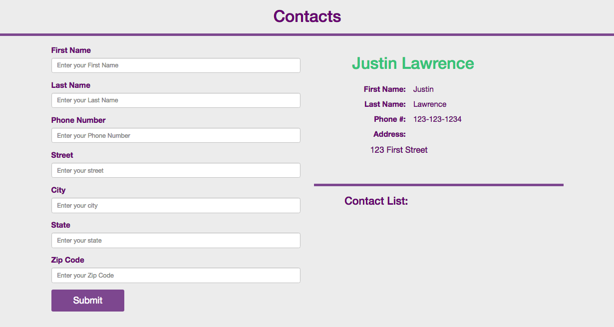

http://yolixtly.com/contact-list-app/

This is one of my favorites app 

Highlights :

This is version 1, we mainly focus on practicing Objects and inheritance 
Some issues we went through: 

- When we submitted the form on click, the value of our inputs were black, we understood that this happened because on Load page we were retriving empty values. The solution was to call the val() method directly in the click event handler scope of the inputs we were interested. 

- On the same event handler, we understood the importance of placing the <em>preventDefault()</em> at the top of that scope to prevent any undesired refresh. 

In Version 2, the refactoring includes :

STEP 6 : Refactor to add multiple Contacts per NewContact. 
 - First html add a button to add new contact. Be careful of format behavior instead of button use a span or an input['type=button']
 - Add a method to Contact Object that saves new Addresses to 1 single Contact. Array of Object. Address Object 
 - The extra addresses can be removed : requires business logic and a button to remove the element from the DOM

STEP  7 : Add similar functionality to add extra phone numbers 

STEP 8 : Design including animations

